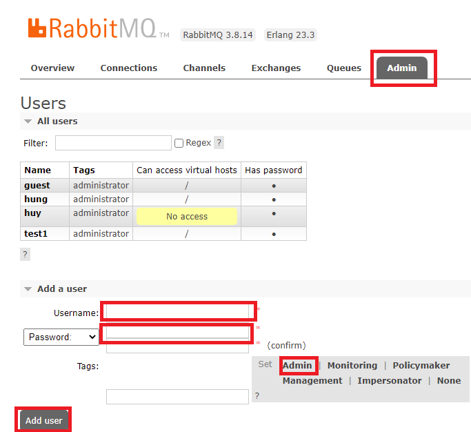
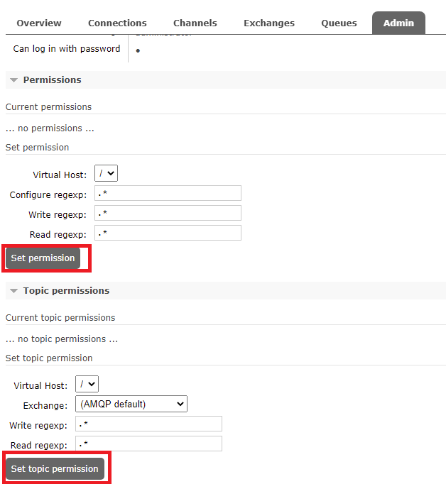

## Project Description

The project aims to build a sub module of the internal CRM, called "Capability Development System". It provides below major features for the employees and the managers to define the career paths and the related training plans.
  
## Architecture Overview
  
  
  
## Requirements
* JDK 11(AdoptOpenJDK LTS)
* Node.js 
* npm 
* Maven
* RabbitMQ 
* Docker

    **Notes on setting up Maven**:
    Add the bin folder inside extracted folder to your user PATH environment variable (How to add: https://www.imatest.com/docs/editing-system-environment-variables/#Windows)

## Development Setup

### Back-end

1. You need a PostGreSQL server running. Install and run PostGreSQL according to your OS with username=postgres, password=Abcd1234, database=postgres
   
   - Install and start postgres server on Windows:
     - Download postgres binary from https://www.enterprisedb.com/download-postgresql-binaries, extract and navigate to its bin folder:
       
       ```bash
         cd pgsql\bin
       ```
     - initialize database with password Abcd1234 (only needed for first time configuration after download)
       
       ```bash
         initdb -D ..\pgdata -U postgres -W -E UTF8 -A scram-sha-256
       ```
     - start database (needed everytime to start project)  
       
       ```bash
         pg_ctl -D ..\pgdata -l logfile start
       ```
   - Install and start postgres  for other operating system:
     - https://www.postgresql.org/download/

2. Start the authentication service (spring boot project)
   
   - Download source: http://tfs.logigear.com/MWD/_git/CDO
     
     ```bash
       cd authentication
     ```
   - Run project either SpringToolSuite4 or command as following
     
      - for Windows (if commands could not run, see Notes* below):
     ```bash
       mvnw spring-boot:run
     ```
      - for other operating system (if commands could not run, see Notes* below):
     ```bash
       ./mvnw spring-boot:run
     ```
3. Start the admin service (spring boot project)

    - Download source: http://tfs.logigear.com/MWD/_git/CDO

      ```bash
        cd admin
      ```
    - Run project either SpringToolSuite4 or command as following

        - for Windows (if commands could not run, see Notes* below):
      ```bash
        mvnw spring-boot:run
      ```
        - for other operating system (if commands could not run, see Notes* below):
      ```bash
        ./mvnw spring-boot:run
      ```     
     
4. Start the manager service (spring boot project)

    - Download source: http://tfs.logigear.com/MWD/_git/CDO

      ```bash
        cd manager
      ```
    - Run project either SpringToolSuite4 or command as following

        - for Windows (if commands could not run, see Notes* below):
      ```bash
        mvn clean install
        mvnw spring-boot:run
      ```
        - for other operating system (if commands could not run, see Notes* below):
      ```bash
        ./mvn clean install
        ./mvnw spring-boot:run
      ```

5. Start the employees service (spring boot project)
   
   - Download source: http://tfs.logigear.com/MWD/_git/CDO
     
     ```bash
       cd employees
     ```
   - Run project either SpringToolSuite4 or command as following
     
       - for Windows (if commands could not run, see Notes* below):
     ```bash
       mvn clean install 
       mvnw spring-boot:run
     ```
      - for other operating system (if commands could not run, see Notes* below):
     ```bash
       ./mvn clean install
       ./mvnw spring-boot:run
     ```
     
     
     **Notes***
     
     If ./mvnw spring-boot:run could not run, please install mvn wrapper:
     
     ```bash
     authentication$ mvn -N io.takari:maven:wrapper
     ```

### Front-end

Front-end is a webserver run at port 4200

1. The Angular application can be started with npm. First, you need to download the dependencies with:
   
   ```bash
    crm-app-client$ npm install
   ```
2. Then, you start the server with:
   
   ```bash
    crm-app-client$ npm start
   ```

## Manual Deployment

### Back-end

1. You need a PostGreSQL server running. Install and run PostGreSQL according to your OS with username=postgres, password=Abcd1234, database=postgres
    Note: If you want to access PostGreSQL from outsite loclahost, edit pg_hba.conf in the installed folder and edit following line:
   
   ```
    # IPv4 local connections:
    host    all             all             all
   ```
   
    Install postgres server on windows:
   
        - Download postgres binary from https://www.enterprisedb.com/download-postgresql-binaries and extract it
        - cd pgsql\bin
        - initialize database: initdb -D ..\pgdata -U postgres -W -E UTF8 -A scram-sha-256 then enter password Abcd1234 (username is postgres)
        - start database:  pg_ctl -D ..\pgdata -l logfile start


2. You need a RabbitMQ server running. Run the server according to the instructions for your OS, for example:
   
   ```bash
    $ rabbitmq-server
   ```
   
    Open to rabbitMQ web manager at http://localhost:15672/, login with default user 'gues't (password: 'guest'). Create user 'hung' with password 'hung' as following:
    
    
    
    If you want to access your rabbitMQ server outside localhost, double click on created user and add permission for this user:
    
    

### Front-end
Front-end is a webserver run at port 4200
1. The Angular application can be started with npm. First, you need to download the dependencies with:
   
   ```bash
    crm-app-client$ npm install
   ```
2. Then, you start the server with:
   
   ```bash
    crm-app-client$ npm start
   ```

## Deployment with Docker

1. Install Docker Desktop
	+ Windows: [Install Docker Desktop ](https://docs.docker.com/docker-for-windows/install/)
	+ macOS:  [Install Docker Desktop on Mac](https://docs.docker.com/docker-for-mac/install/)

2. Change directory from root project  to docker folder:
   
   ```bash
   cd docker
   ```
3. Builds, (re)creates, starts, and attaches to containers for a service
   
   ```bash
   docker-compose up -d
   ```
4. Run importDB.bat to create database
