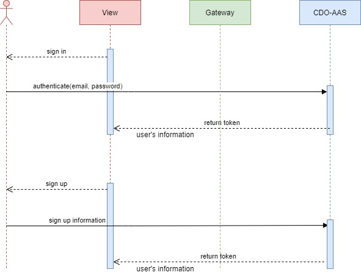

# Introduction 
CDO-AAS Service stand for Capability Development System- Authentication and Authorization Service
+ Sign In, Sign Up, Sign Out

#  Tool / Library
+ eclipse
+ lombok

# Authentication / Authorization flowchart

# REST API
+ /api/auth/signin
+ /api/auth/signup

# How to debug
+ Start service "crm-certification-service" as debug mode. The default port is 5001, but you can modify in application.yml.
+ Refer [link](..CDO-Spring-CRM.postman_collection.json) for postman collection to debug this service.