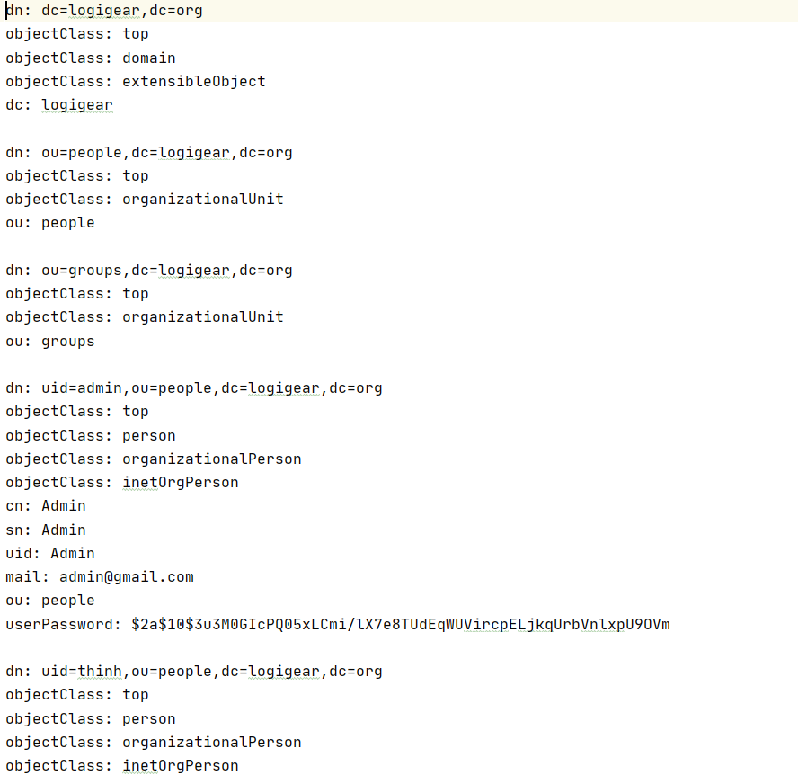

@github/createdAt - 24/07/2021                @github/updatedAt - 04/08/2021

## Authentication Service Description

This service aims to provide authentication, authorization functionality and to deal with user's credential data. Here are some functionalities built inside this service:
 - Sign up
 - Sign in
 - Email verification
 - Forgot password and reset password
 - Change password

## Service's Architecture Overview

- **java** folder contains all the classes defined in this service
- **resource** folder contains global configuration and properties that are used by the classes in **java** folder

## Configuration
- **PostgreSQL**: the service uses PostgreSQL to manage database.
- **JWT security**: the service implements JWT for security and authentication purposes. 
- **Consul**: the service uses Consul as a **service discovery** for client to register their services on a server and as a **config server** to centralized all service configuration.
- **Mail Config**: The users configures basic mail properties such as host address, smtp server, sender username and password, ...

### Java Folder

- **config** folder contains classes used to configure different aspects such as **Mail, security, and CORSFilter**.
- **controller** folder contains the controller of this service.
- **exception** folder contains *dev* define exceptions. It contains a global exception handler to handle exception caused by the controller.
- **model** folder contains all core entities for building database and using as *Data Access Object* between **Repository layer** and **Service layer**.
- **payload** folder contains responses and requests from users and acts as a *Data Transfer Object*.
- **property** folder contains the application's important properties.
- **respository** folder contains the fundamental layer that connects to the database. Extends from JPA repository.
- **security** folder contains some objects used for security purposes *(This folder is used mainly for JWT)*.
- **service** folder contains the application's logic layer.
- **startup** folder aims for database configuration when initailizing application.
- **util** folder contains the utilities supporting other classes.
- **validation** folder contains validation for input data.
- File **CareerApplication.java** is the main file for running Authentication Service.

### Resource Folder

- **application.yml** defines global configuration and properties for the app.
- **Resource Bundle 'messages'** contains self-defined error messages when returning an error response to clients.

## LDAP Authentication

LDAP is for applying sign in functionality via the database from enterprise's Windows Server called LDAP Server. LDAP Authentication is used side by side JWT Authentication. To make LDAP usable, follow below steps to implement:

1. Add these dependencies:

2. Create a LDIF file *(only in sprint 2)*:

**Note:** From sprint 3 on, we do not use ldif file anymore. Instead we integrate with enterprise's real LDAP Server.

3. Add global configuration parameters in file *application.yml*:

**Note:** These parameters must be laid inside *spring node*.

4. Change JWT Authentication configuration into LDAP Authenticationn configuration:

5. Create User or EmployeeDetails if one or both instances do not exist: 

6. Update User or EmployeeDetails if one or both existed:

## Cautions:

   - If project does not use LDAP Authentication with LDIF file, remember to comment out **unboundid-ldapsdk** denpendency.

   - In fact, JWT Authentication is swapped with LDAP Authentication. Now only JWT token is created.

   - Password in .ldif file is encoded with BCrytEncoder.

   - Private class UserAttributeMapper is needed to extract username in .ldif file *("cn" attribute in .ldif file)* via *getDn()* method provided by *LdapTemplate*.
