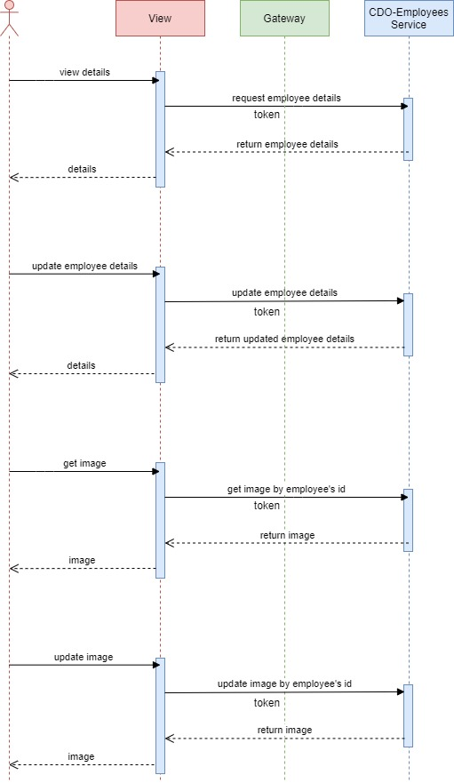
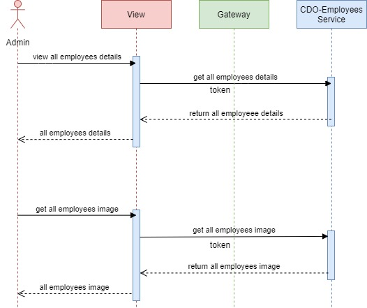

@github/updatedAt - 04/08/2021
# Introduction 
CDO-Employees Service
+ Manage (view/update) employees's details.
+ Use `mvn clean install` before starting service.

#  Tool / Library
+ eclipse
+ lombok
+ mapstruct
+ model mapper

# Employee Flowchart

# Admin Flowchart

# REST API
+ /api/employees/{id}  
+ /api/employees/update 
+ /api/employees 
+ /api/image/{id}
+ /api/image
+ /api/image (ADMIN)
+ /api/employees (ADMIN)
+ /api/employees/department (ADMIN,MANAGER)
+ /api/employees/project (ADMIN,MANAGER)
+ /api/employees/update-project-department/{id} (ADMIN,MANAGER)
+ /api/employees/upload-file?idEmployee={id}
+ /api/employees/download-file/{filename:+}
+ /api/employees/file/{id}

# How to debug
+ Run "mvn package" to build EmployeeMapperImpl before start debug.
+ Start service "crm-employees-service" as debug mode. The default port is 5002, but you can modify in application.yml.
+ Refer [link](..CDO-Spring-CRM.postman_collection.json) for postman collection to debug this service.

# Save avatar in web service
## Feature description 
+ Avatar's employee when employee upload is saved in folder **"image"** in web service (resource folder).
+ Name's image will look like: "id_random32charUUID.png".
+ When user request get image will return "EncodedBase64Image".
+ User have role **Admin** can get all avatar's employee.
## REST API
+ /api/image/{id}
+ /api/image
+ /api/image (ADMIN)

# Assign Project and Edit department for Employee

## Feature description 
+ User have role **Admin** or **Manager**, I can edit the department & the assigned project for employees to get the resource allocation updated.
+ **Admin/Manager** can edit the department, assigned project from the employee information page.
+ **Admin** can update these information for all employees.
+ **Managers** can update these information for employees under their supervision.
+ An employee belongs to 01 department and can be assigned to 01 project at a time.

# Assign Manager and Cdm for Employee 

## Feature description

+ User have role **Admin** can assign manager and cdm to employees to let them know who manage them
+ Only **Admin** can update these information for all employees
+ An employee only have one manager and one cdm at a time
## REST API
+ /api/employees/department (ADMIN,MANAGER)
+ /api/employees/project (ADMIN,MANAGER)
+ /api/employees/update-project-department/{id} (ADMIN,MANAGER)

# Upload Resumes

## Feature description 
+ User can upload their resume.
+ **Employee** can upload their resume in their Information page.
+ **Admin/Manager** can upload their employee resume in the Employee Information Page.
+ All User cannot upload within 6s after an upload.

# Download Resumes

## Feature description 
+ User can download their resume.
+ **Employee** can download their resume in their Information page.
+ **Admin/Manager** can download their employee resume in the Employee Information Page.
+ All User cannot download within 6s after an download.

# Update Resumes Status

## Feature description 
+ As a User, CDM/Manger can update their resume status.
+ When a user upload their resume their status become To be reviewed and **CDM/Manager** can update resume status into To be updated or Verified.
+ **CDM/Manager** can update their employee resume status in Information Page.
+ When **CDM/Manager** update status to To be updated their will be a note for employee to let employee know what they have to update in their resume.

## REST API
+ /api/employees/upload-file?idEmployee={id}
+ /api/employees/download-file/{filename:+}
+ /api/employees/file/{id}
