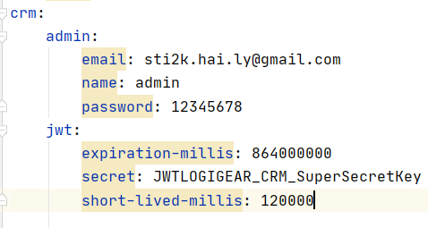
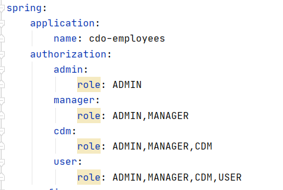
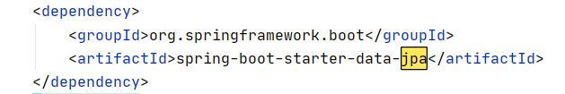
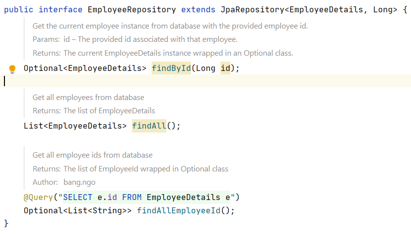
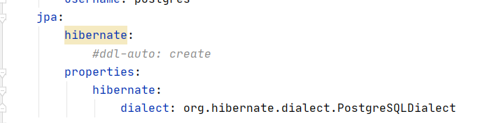
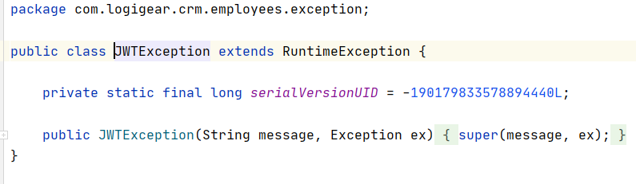
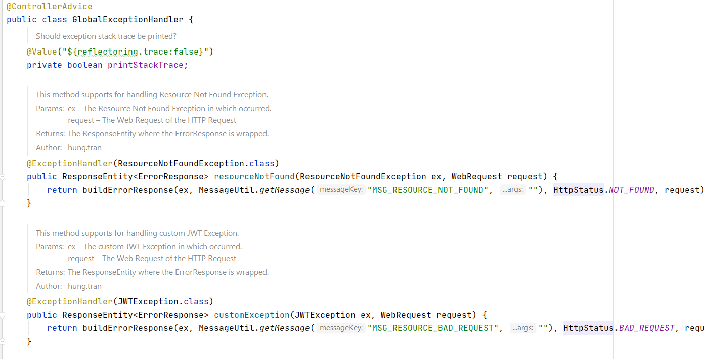
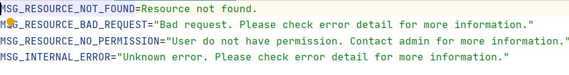
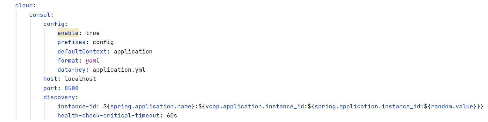
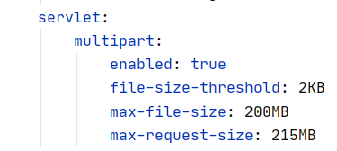

@github/createdAt - 25/07/2021                @github/updatedAt - 18/08/2021

## Employee Service Description

This service aims to look up and extract employees' details from database. Besides, service also allows users to update their profile and upload their avatar. Some functionalities in this service are:
 - Extracts a list of employees or an employee's profiles
 - Update an employee's details
 - Extract avatar of one or many employees
 - Upload an image of an employee

## Spring Security Principles

In this project, we apply JWT authentication with role-based authorization from Spring Security module. Therefore some rules regulated by Spring Security must be abided.

1. JWT authetication is conducted inside **Authentication** service. When a user sign in, the *signin API* returns to user an authorization string which determines if a user has the right to access **Employee** service's APIs. The authorization string contains encoded user's credetial data such as roles, email, username.

2. When an authenticated user tries to access an API from this service, the user's credential data is passed into a JWT filter *(name: JWTAuthenticaitonFilter.java)* in order to let the filter checks if data contains the authorization string is in right format *(format: Bearer <JWT token>)* or has a valid JWT token. If authorization string is valid, user data is then extracted and stored inside a security context holder for tracking purpose.

3. After filtering a user's request, user's roles are taken out of the context holder to check if the request has the right roles to use a certain API or not. If the request is valid enough then the API method is used. Otherwise a 401 error message is returned to the user.

**Note:** There are 2 configurations must be considered:
  1. JWT secret key and other properties must be configured inside *application.yml* 

  2. List of roles is also put inside *application.yml*

**Requirements to use Spring Security:**
  - SecurityConfig: the main config file that is used by Spring Security as security context holder. This file contains many configuration about the service's security.
  - JWTProvider: provides tools to contact JWT token.
  - JWTAuthenticationFilter: filters user's request to check if the user is authenticated or not and to extract user's credentials.

## Repository Using JPA

Repository layer in this service is used with JPA. JPA is a tool suite that not just has basic CRUD functionality but also supports pagination when extracting data from database. To use JPA, *spring-boot-starter-data-jpa* package has to be included inside *pom.xml*.

After adding dependency, every repository class must implemnts JpaRepository interface in order to use JPA methods.

Also, hibernate configuration needs to be declared inside *pom.xml* so that the app could know the way to create database and the way to retrieve data from database

## Model

**Note:** Entities that are used inside this service just have one purpose only. They are used as Data Transfer Object.

## Global Exception

When an API returns an error message to front end, that message should be specific to each situations though in some cases the error code would be the same. Class *GlobalExceptionHandler.java* solve that problem by giving each self-defined exception a respective error message. Each message is stored inside *Resource Bundle 'message'* folder in *Resource* folder.

**Rules:**

  1. Create a self-defined exception

  

  2. Add that exception into class *GlobalExceptionHandler.java*

  

  3. Add error message

  

## Consul

Consul acts like a datacenter that controls request's flow to the right service and provides many functionalities which works better than a server could give. To configuare consul in our app, add these codes to *application.yml*.

## Multipart

Multipart allows user's requests to submit files to the server. To let user use this feature, add below codes to *application.yml*.

## Service For OrgChart - Department Structure Tree

To get data for the department structure tree from Front end, we built 3 methods as shown below:

1. To get employee by department

2. To get one department following its id

3. To get all the department

## Cautions

1. Do NOT add CORS configuration to each service *(except ***GatewayService.java***)* because CORS configuration is manually added to Gateway's *application.yml*.

2. If you changed database's info in *application.yml*, please revert back to default to be suitable for the whole team or put *application.yml* inside *.gitignore* before pushing onto remote.