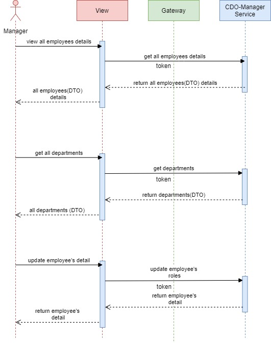

# Introduction 
CDO-Manager Service
+ This service should be one with access level of Manager API
+ Use `mvn clean install` before starting service

# Manager Flowchart

#  Tool / Library
+ eclipse
+ lombok
+ queryDsl

# REST API
+ **Get all employees based on manager and CDM:** /api/manager/employee (MANAGER)
+ **Get all deparments:** /api/manager/department (MANAGER)
+ **Get employee based on manager and CDM:** /api/manager/employee/{id} (MANAGER)
