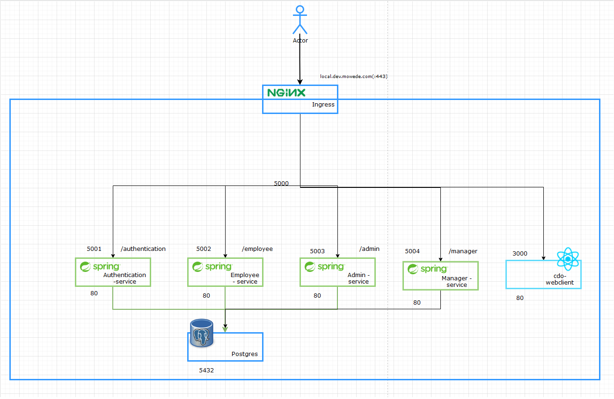
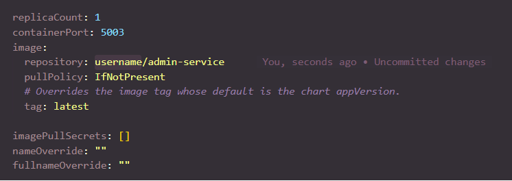

# Deploy CDS with Helm Chart

The project aims to build a sub module of the internal CRM, called "Capability Development System". It provides below major features for the employees and the managers to define the career paths and the related training plans.
The project is divided into many phases. This phase focuses on intialzing the project architecture, adding Employee Management and Resume Management.

## Architecture Overview



## Prerequisites

- A Kubernetes Cluster (Builtin Docker Desktop)

- Docker Desktop: [docker-installer]([Docker Desktop for Mac and Windows | Docker](https://www.docker.com/products/docker-desktop))

- Helm Chart: [helm-installer]([Helm | Helm Install](https://helm.sh/docs/helm/helm_install/))

###### Ensure you have access to Kubernetes:

```shell
kubectl get nodes -o wide
```

_Expected:_

```bash
$ kubectl get nodes
NAME             STATUS   ROLES                  AGE    VERSION
docker-desktop   Ready    control-plane,master   3d1h   v1.21.3
```

###### Install Nginx-Ingress Controller

```bash
kubectl apply -f https://raw.githubusercontent.com/kubernetes/ingress-nginx/controller-v0.48.1/deploy/static/provider/cloud/deploy.yaml
```

## Publishing image to Docker Hub

###### Build and Push Docker Image for Backend

Go to working files

```bash
cd be/
```

Build Docker Image

```bash
. DockerAction.sh -u="Docker Hub Account" -t="Tag Version of Docker Image"
```

---

*For example:*

```bash
. DockerAction.sh -u=user -t=latest
```

###### Build  and Push Docker Image for Frontend

```bash
cd fe/web
. DockerAction.sh -u="Docker Hub Account" -t="Tag Version of Docker Image"
```

```bash
#Script build all service image
#from root Folder
cd deployment
. DockerAction.sh -u="Docker Hub Account" -t="Tag Version of Docker Image"
```
> You can use Deploy_script.sh in service-folder to auto create and push image
#### Using Docker_ALl_Service.sh to build all service image
```bash
cd deployment
docker push $USERHUB/{your-docker-image-name}:$TAG_VERSION
```
| name          | Description                   |
|:------------- | ----------------------------- |
| -u            | Tag version of your image     |
| -t            | Username of DockerHub account |
## Hyperscale Evaluation

Helm is a package manager for Kubernetes that can be used to deploy and manage a scale-out distributed system.

###### Before Install Helm Chart

> Please customize your config image in Value.yaml



*Ps: Override your usename of Docker Hub account in this case*

###### Deploy Database PostgreSQL with helm chart

To init and generate a database please follow these steps

```bash
#From root Folder
cd deployment
. HelmAction.sh -u="Docker Hub Account" -t="Tag Version of Docker Image"
```

###### Helm Deployment

```bash
#From root Folder
#Install authentication
cd be/authentication
helm install authentication-service deployment/
#Install employee
cd be/employee
helm install employees-service deployment/
#Install admin
cd be/admin
helm install admin-service deployment/
#Install manager
cd be/manager
helm install manager-service deployment/
#Install cdo-webclient
cd fe/
helm install cdo-webclient deployment/
```

_Expected:_

```bash
Install Authentication-service Chart
NAME: authentication-service
LAST DEPLOYED: Thu Aug 26 11:31:04 2021
NAMESPACE: default
STATUS: deployed
REVISION: 1
NOTES:
1. Get the application URL by running these commands:
  http://local.dev.mowede.com/authentication
```

To check the status of the deployment, use the following command.

```bash
kubectl get pods
```

*Expected:*

```bash
NAME                                     READY   STATUS             RESTARTS   AGE
admin-service-84f864dd65-494d6           1/1     Running            0          3m7s
authentication-service-cf4d96d6b-dhlpz   1/1     Running            0          3m11s
employees-service-69dccf58b-xb2c2        1/1     Running            0          3m9s
manager-service-85c77b97d4-h5w5t         1/1     Running            0          3m6s
postgresql-statefull-postgresql-0        1/1     Running            0          3m12s
```
## Helm Cleanup

```bash
helm uninstall {chart-name}
```
or using
```bash
cd deployment
. Helm_Uninstall_All_Service.sh
```
## Running CDS

If everything has been set up correctly, you'll now be able to navigate to ingress nginx.

- local.dev.mowede.com

## API Ingress

- Authentication API
  
  - local.dev.mowede.com/authentication

- Employee API
  
  - local.dev.mowede.com/employees

- Admin API
  
  - local.dev.mowede.com/admin

- Manager API
  
  - local.dev.mowede.com/manager

## Generating Data

This is a easy way to create schema and data following this steps

```bash
cd deployment/postgresql/files/docker-entrypoint-initdb.d
```

_In this folder you can copy the script.sql file you want to create and it will be generating at the first time you install Postgres helm chart_

###### Note

More detail for using postgres helm chart please follow this repo:

[Postgres-HelmChart]([charts/bitnami/postgresql at master · bitnami/charts · GitHub](https://github.com/bitnami/charts/tree/master/bitnami/postgresql/#installing-the-chart))
