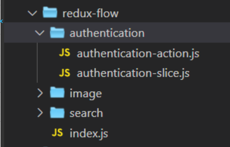
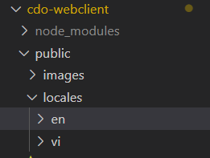
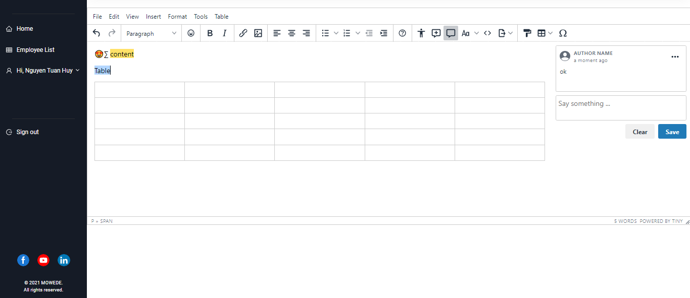
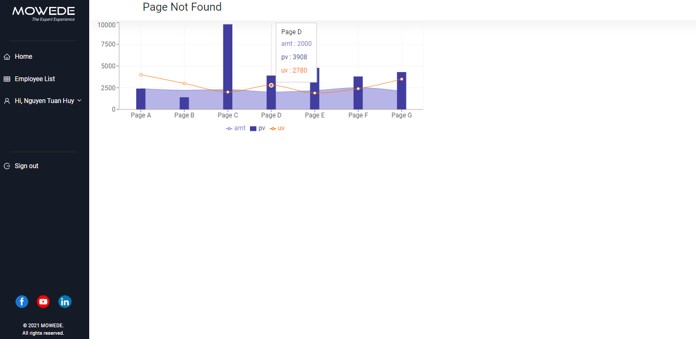
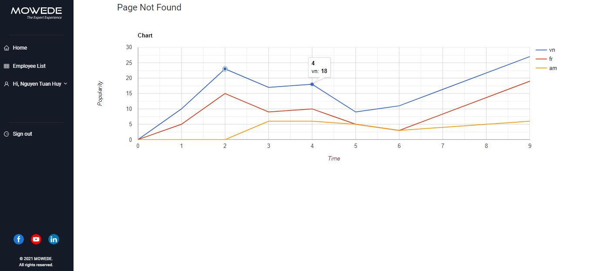
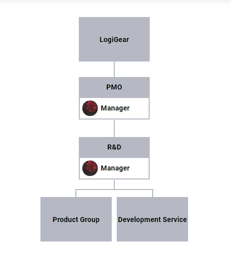
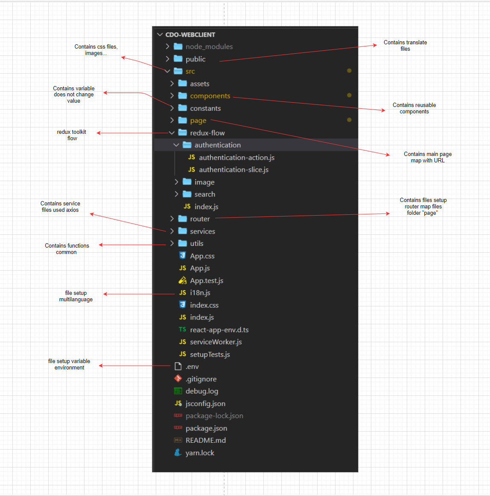

## Technology Overview

1. ReactJS
   - Version : 16.13.1
   - Document:
     - Link: https://reactjs.org/docs/getting-started.html
   - React hook
     - Link: https://reactjs.org/docs/hooks-intro.html
2. Redux Toolkit
   - Global State's App is managed by Redux Toolkit in folder **"redux-flow"**
     
   - The Redux toolkit docs are located at :
     [Usage Guides](https://redux-toolkit.js.org/introduction/getting-started)
3. Formik
   - Formik is used by handle **Form in App** (form sign in, sign up, form update,...)
   - Using <Formik/> component for build form in App.
   - Formik in App has integrated **Yup** lib for validate field in form.
   - Formik has integrated _"formik-antd"_ lib for build field quickly
     - Link document: https://github.com/jannikbuschke/formik-antd
4. Axios
   - Link document: https://github.com/axios/axios
5. Ant Design UI
   - Link document : https://ant.design/docs/react/introduce
6. I18next
   - Link document : https://react.i18next.com/
     
7. CSS
   1. Requirements
      - Project uses pure CSS files (no CSS module or styled component must be used)
      - Please use **BEM naming convention** to prevent overlapping styles.
      - Use **\<Container />** from component/UI to wrap component's content for consistency.
   2. Files structure
      - All CSS files must be placed in **component/assets**.
      - Other CSS static assets (images, etc.) are store in **component/assets** as well.
      - Each component in **/page** has separate CSS file. CSS filename the same as component's name.
      - Files are imported directly to their components except global CSS files.
      - Global CSS files (variables.css, global.css, formik.css) are imported to **index.css**.
8. Text Editor
   - For **edit document**, CV 's employee. 
   
   1. Tinymce
      - Link document: https://www.tiny.cloud/docs
   2. CKEditor
      - Link document: https://ckeditor.com/docs/ckeditor5/latest/builds/guides/integration/frameworks/react.html

9. Charts
   1. ReCharts
      - Link document: https://recharts.org/en-US/guide/
      
   2. React Google Charts
      - Link document: https://react-google-charts.com/
      
   3. Org Chart
      - Link document: https://github.com/dabeng/react-orgchart
      
      
## Architecture Overview



## Requirements

- Node.js
- npm

## Development Setup

### Front-end

Front-end is a webserver run at port 3000

1. The ReactJS application can be started with npm. First, you need to download the dependencies with:

   ```bash
    cdo-webclient$ npm install
   ```

2. Then, you start the server with:

   ```bash
    cdo-webclient$ npm start
   ```
